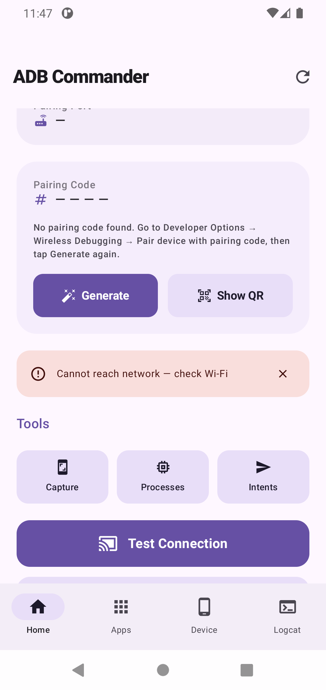
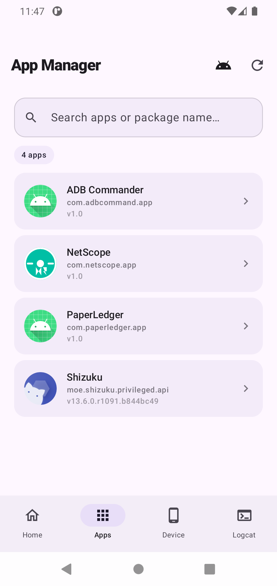
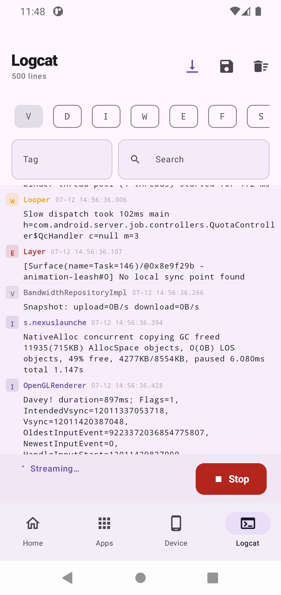
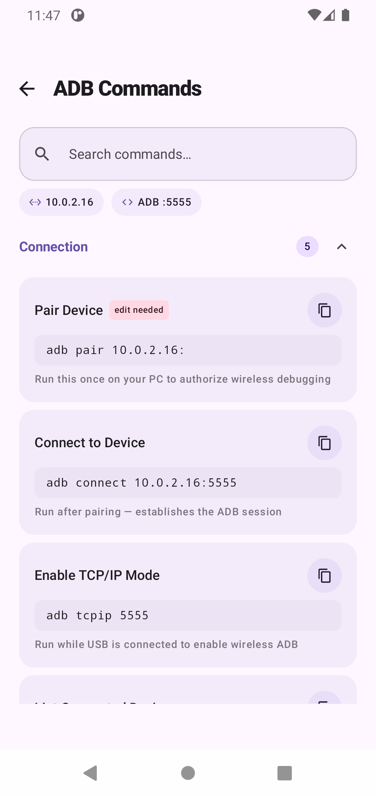
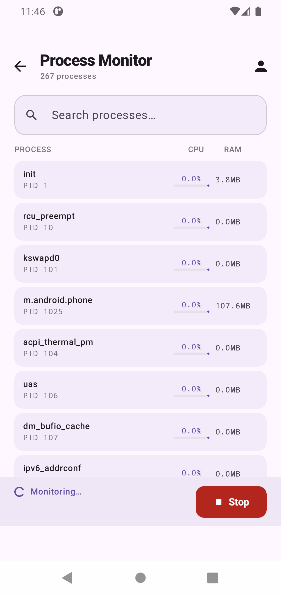
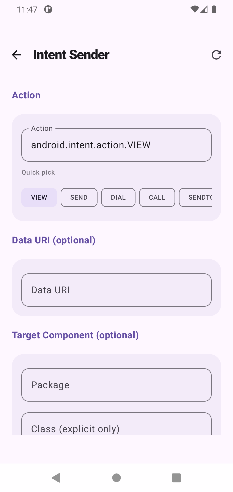

# ADB Commander

> Your Android device is now its own ADB workstation.

ADB Commander eliminates the laptop from your Android debugging workflow. Using Shizuku for privileged shell access, it runs ADB operations directly on the device — reading logcat, killing processes, inspecting apps, capturing screenshots, monitoring CPU and RAM — all without a USB cable or a PC.

---

## Screenshots

| Home | App Manager 
|------|-------------|
|  |  |

| Logcat | ADB Commands |
|--------|--------------|
|  |  |

| Process Monitor | Intent Sender |
|---------------|-----------------|
|  |  |

> Take screenshots on a real device and place them in a `screenshots/` folder at the root of the repo. The README will render them automatically.

---

## Features

### Home

- Auto-detects device IP, ADB port, and pairing port via Shizuku
- Reads the active wireless debugging pairing code from system settings — no manual entry
- Builds `adb pair` and `adb connect` commands ready to copy in one tap
- Test Connection pings 8.8.8.8 and shows a success or failure banner
- Shizuku status card with live permission state and one-tap grant button
- Tool shortcuts to Capture, Process Monitor, and Intent Sender

### ADB Commands

- 28+ commands across 5 categories: Connection, App Management, Device & System, Capture, Logs
- Every command is built dynamically from your device's actual IP, ADB port, pairing port, and pairing code
- Live search across command title, command string, and hint text
- Collapsible category sections with command count badges
- One-tap copy with a 1.5-second "Copied" confirmation flash
- Edit-needed badge on commands that require custom values

### App Manager

- Lists all installed apps using `PackageManager` with correct system/user filtering
- Toggle to include or exclude system apps
- Search by app name or package name with debounced filtering
- Per-app action bottom sheet:
  - **Launch** — opens the app via `getLaunchIntentForPackage`
  - **Kill** — `am force-stop` via Shizuku, falls back to `killBackgroundProcesses`
  - **Clear Data** — `pm clear` via Shizuku, falls back to App Info screen
  - **Extract APK** — copies APK from `publicSourceDir` to Downloads/ExtractedAPKs
  - **Uninstall** — `pm uninstall` via Shizuku, falls back to system dialog
  - **Inspect** — opens the full App Inspector for this package

### Device Info

- **System** — model, manufacturer, Android version, API level, build number, security patch
- **Hardware** — screen size, density, CPU ABI, total RAM
- **Battery** — live progress bar with color that shifts green → amber → red, health, temperature, voltage
- **Network** — IP address, Wi-Fi state
- Copy Device Profile exports all fields as a shareable plain-text block
- Shimmer loading skeleton on first load while shell commands run concurrently

### Logcat

- Streams live logcat output line by line using a cold Kotlin `Flow`
- The underlying process is automatically killed when collection is cancelled
- Level filter chips (V / D / I / W / E / F / S) applied server-side as logcat flags
- Tag filter applied server-side via `-s TAG:level` — restarts the process with new flags
- Text search applied client-side — no process restart needed
- 2000-line rolling buffer using `takeLast()` to prevent OOM on long sessions
- Every line gets a monotonically incrementing `Long` id to prevent `LazyColumn` key collisions
- Auto-scroll toggle, save timestamped `.txt` to Downloads/AdbCommander, clear buffer

### Capture

- Screenshot taken via `screencap -p` through Shizuku, written to app cache, decoded as `Bitmap`
- Instant in-app preview with save to gallery and share via system share sheet
- Screen recording via `screenrecord` using `Runtime.exec` directly (no PTY issues)
- Live elapsed timer with pulsing REC dot animation
- `SIGINT` sent on stop to let `screenrecord` finalize the MP4 cleanly before `destroy()`
- Recordings saved to Movies/AdbCommander and scanned into MediaStore

### App Inspector

Deep `PackageManager` inspection of any installed app — no Shizuku or root required.

Nine accordion sections:

| Section | Contents |
|---------|----------|
| Identity | Package name, version name/code, install date, update date, installer source |
| Build Info | Target SDK, min SDK, compile SDK with Android version names, debuggable flag, test-only flag |
| Storage | APK file size, APK path, data directory |
| Signing Certificate | Subject DN and SHA-256 fingerprint |
| Activities | All declared activities with exported badge |
| Services | All declared services with exported badge |
| Broadcast Receivers | All receivers with exported badge |
| Content Providers | All providers with exported badge |
| Permissions | Split into Granted and Denied with color-coded icons |

Every value has a copy-to-clipboard icon button. A DEBUG badge appears on the header if the app is debuggable.

### Process Monitor

- Live CPU% and RAM per running process, updated every 1.5 seconds
- CPU calculated from `/proc/<pid>/stat` tick deltas between samples
- RAM read from `VmRSS` in `/proc/<pid>/status`
- Color-coded CPU progress bars — green below 20%, amber below 50%, red above 50%
- User-only toggle to hide system processes (UID < 10000)
- Search filter by process name
- Sorted by CPU usage descending

### Intent Sender

- Build and fire any Android intent from a clean form UI
- Fields: Action, Data URI, Package, Component Class
- Extras with typed values: String, Int, Boolean, Long, Float
- Quick-pick chips for 12 common actions including `VIEW`, `SEND`, `DIAL`, `SETTINGS`
- Fires via `context.startActivity()` with live success/error feedback
- Reset button clears the entire form back to defaults

### Settings

- Shizuku status card — active, permission needed, or not running — with Grant button
- Current plan badge (Free / Pro)
- Upgrade to Pro navigates to the Paywall screen
- Restore Purchase re-verifies entitlement with the Stripe backend
- Rate on Play Store, Privacy Policy, Contact Support, GitHub link
- App version from `BuildConfig.VERSION_NAME`

---

## Free vs Pro

| Feature | Free | Pro |
|---------|------|-----|
| View device IP and ports | ✅ | ✅ |
| Copy ADB commands | ✅ | ✅ |
| Browse installed apps | ✅ | ✅ |
| Launch any app | ✅ | ✅ |
| Stream logcat | ✅ | ✅ |
| View device info | ✅ | ✅ |
| Test network connection | ✅ | ✅ |
| Screenshot and share | ✅ | ✅ |
| Record screen | ✅ | ✅ |
| Fire intents | ✅ | ✅ |
| Inspect any app | ✅ | ✅ |
| Monitor processes | ✅ | ✅ |
| Force Stop app | ❌ | ✅ |
| Clear app data | ❌ | ✅ |
| Extract APK | ❌ | ✅ |
| Silent uninstall | ❌ | ✅ |
| Save logcat to file | ❌ | ✅ |
| Logcat tag filter | ❌ | ✅ |
| Logcat level filter | ❌ | ✅ |
| Copy device profile | ❌ | ✅ |

Pro is a **one-time purchase**. Payment is processed by Stripe and verified server-side before Pro access is granted. The client-side `PaymentSheetResult.Completed` result alone never unlocks Pro.

---

## Tech Stack

| Layer | Technology |
|-------|------------|
| Language | Kotlin 2.2.0 |
| UI | Jetpack Compose + Material 3 |
| Architecture | MVVM + Clean Architecture (Domain / Data / Presentation) |
| Dependency Injection | Hilt + KSP 2.2.0-2.0.2 |
| Navigation | Navigation Compose 2.9.0 |
| Shell Access | Shizuku 13.1.5 via reflection on `newProcess()` |
| Async | Kotlin Coroutines + Flow |
| Persistence | DataStore Preferences 1.1.1 |
| Payments | Stripe Android SDK 23.6.0 |
| Backend | Node.js + Express on Railway |
| Build System | AGP 8.13.2 |
| Compose BOM | 2025.05.00 |
| Min SDK | 26 (Android 8.0 Oreo) |
| Target SDK | 36 |

---

## Architecture

```
app/
├── core/
│   ├── Routes.kt                        Navigation route constants and builders
│   ├── CaptureCommands.kt               Shell command strings for screencap/screenrecord
│   └── ShizukuShellExecutor.kt          Reflection-based privileged shell runner
│
├── data/
│   └── repository/
│       ├── AppInspectorRepositoryImpl.kt
│       ├── CaptureRepositoryImpl.kt
│       ├── LogcatRepositoryImpl.kt
│       ├── ProcessMonitorRepositoryImpl.kt
│       └── StripeBillingRepositoryImpl.kt
│
├── domain/
│   ├── billing/
│   │   ├── Feature.kt                   Feature enum, FREE_FEATURES, PRO_FEATURES sets
│   │   ├── FeatureManager.kt            Central gatekeeper injected across ViewModels
│   │   └── UserEntitlement.kt           Plan state model (FREE / PRO)
│   ├── models/                          All domain data classes
│   ├── repository/                      Repository interfaces
│   └── usecase/                         One class per use case
│
└── presentation/
    ├── ui/
    │   ├── components/
    │   │   └── BottomNavItem.kt         Bottom nav tab definitions and detailRoutes list
    │   └── features/
    │       ├── home/                    Home screen + HomeViewModel + ShizukuStatusCard
    │       ├── appmanager/              App Manager + bottom sheet actions
    │       ├── deviceinfo/              Device Info with shimmer skeleton
    │       ├── logcat/                  Logcat streaming with Flow
    │       ├── capture/                 Screenshot and screen recording
    │       ├── inspector/               App Inspector with 9 accordion sections
    │       ├── processmonitor/          Live process CPU/RAM monitor
    │       ├── intentsender/            Intent builder and sender
    │       ├── settings/                Settings and account management
    │       └── paywall/                 Stripe PaymentSheet integration
    └── MainActivity.kt                  NavHost, bottom bar, all route registrations
```

---

## Shizuku

ADB Commander uses [Shizuku](https://github.com/RikkaApps/Shizuku) to execute shell commands as the `shell` user. This enables privileged operations — `am force-stop`, `pm clear`, `screencap`, `/proc` filesystem reads, system settings access — without root and without a PC.

### Android 11 and above — no PC needed at all

```
1. Install Shizuku from the Play Store
2. Open Shizuku
3. Tap "Start via Wireless Debugging"
4. Open ADB Commander and grant the permission prompt
```

Shizuku persists across reboots using Wireless Debugging on Android 11+. No cable ever required.

### Android 10 and below — one-time PC setup

```bash
# Connect phone to PC via USB, then run:
adb shell sh /sdcard/shizuku/start.sh
# Disconnect the cable
```

After a reboot, this command needs to be run again. Upgrading to Android 11 removes this requirement permanently.

---

## Payment Backend

The Stripe secret key never lives in the Android app. A minimal Node.js + Express server handles all Stripe API calls and must be deployed before payments work.

### Endpoints

| Method | Path | Description |
|--------|------|-------------|
| `POST` | `/create-payment-intent` | Creates a Stripe PaymentIntent and returns `client_secret` |
| `POST` | `/verify-purchase` | Verifies payment status directly against the Stripe API |
| `POST` | `/webhook` | Handles Stripe server-side payment lifecycle events |
| `GET` | `/health` | Returns `{"status":"ok"}` — use to confirm server is running |

### Environment variables

```env
STRIPE_SECRET_KEY=sk_live_...
STRIPE_WEBHOOK_SECRET=whsec_...
PORT=3000
```

### Deploy to Railway (free tier)

```bash
# 1. Create a GitHub repo containing server.js, package.json, and .gitignore
# 2. Go to railway.app → New Project → Deploy from GitHub repo
# 3. Add the three environment variables in the Railway Variables tab
# 4. Go to Settings → Networking → Generate Domain
# 5. Copy the URL — this is your BASE_URL
```

### Test cards (test mode only — no real money charged)

| Card number | Result |
|-------------|--------|
| `4242 4242 4242 4242` | Payment succeeds |
| `4000 0000 0000 0002` | Card declined |
| `4000 0027 6000 3184` | Requires 3D Secure |

Use any future expiry date, any 3-digit CVV, any postcode.

---

## Configuration

Two values must be set before building:

```kotlin
// app/data/repository/StripeBillingRepositoryImpl.kt
private const val BASE_URL = "https://your-railway-url.up.railway.app"

// app/presentation/ui/features/paywall/PaywallScreen.kt
private const val STRIPE_PUBLISHABLE_KEY = "pk_live_your_key_here"
```

---

## Build Configuration

```toml
# gradle/libs.versions.toml

[versions]
agp = "8.13.2"
kotlin = "2.2.0"
ksp = "2.2.0-2.0.2"
composeBom = "2025.05.00"
hilt = "2.56.2"
stripe = "23.6.0"
shizuku = "13.1.5"
datastore = "1.1.1"
navigationCompose = "2.9.0"
hiltNavigationCompose = "1.2.0"
lifecycleRuntimeKtx = "2.10.0"
activityCompose = "1.12.4"
coreKtx = "1.17.0"

[plugins]
android-application = { id = "com.android.application", version.ref = "agp" }
kotlin-android = { id = "org.jetbrains.kotlin.android", version.ref = "kotlin" }
kotlin-compose = { id = "org.jetbrains.kotlin.plugin.compose", version.ref = "kotlin" }
ksp = { id = "com.google.devtools.ksp", version.ref = "ksp" }
hilt = { id = "com.google.dagger.hilt.android", version.ref = "hilt" }
```

---

## Running the Project

```bash
git clone https://github.com/god-s-only/adb-commander
cd adb-commander
```

1. Open in **Android Studio Hedgehog** or later
2. Sync Gradle
3. Set `BASE_URL` and `STRIPE_PUBLISHABLE_KEY` as described above
4. Run on a **physical Android device** — Shizuku does not work on emulators

---

## Manifest Requirements

The following permissions and providers are required in `AndroidManifest.xml`:

```xml
<uses-permission android:name="android.permission.INTERNET" />
<uses-permission android:name="android.permission.QUERY_ALL_PACKAGES" />
<uses-permission android:name="android.permission.ACCESS_WIFI_STATE" />
<uses-permission android:name="android.permission.ACCESS_NETWORK_STATE" />

<!-- FileProvider for sharing screenshots and recordings -->
<provider
    android:name="androidx.core.content.FileProvider"
    android:authorities="${applicationId}.fileprovider"
    android:exported="false"
    android:grantUriPermissions="true">
    <meta-data
        android:name="android.support.FILE_PROVIDER_PATHS"
        android:resource="@xml/file_provider_paths" />
</provider>
```

---

## Going Live with Stripe

When ready to accept real payments:

1. Complete business verification in the Stripe Dashboard
2. Toggle from **Test mode** to **Live mode**
3. Get live keys (`sk_live_` and `pk_live_`) from Developers → API keys
4. Update Railway environment variables with live keys
5. Create a new live webhook pointing to `/webhook`
6. Update `STRIPE_PUBLISHABLE_KEY` in `PaywallScreen.kt` with the `pk_live_` key
7. Publish the updated app to the Play Store

---

## License

```
MIT License

Copyright (c) 2025 Oneshioze

Permission is hereby granted, free of charge, to any person obtaining a copy
of this software and associated documentation files (the "Software"), to deal
in the Software without restriction, including without limitation the rights
to use, copy, modify, merge, publish, distribute, sublicense, and/or sell
copies of the Software, and to permit persons to whom the Software is
furnished to do so, subject to the following conditions:

The above copyright notice and this permission notice shall be included in all
copies or substantial portions of the Software.

THE SOFTWARE IS PROVIDED "AS IS", WITHOUT WARRANTY OF ANY KIND, EXPRESS OR
IMPLIED, INCLUDING BUT NOT LIMITED TO THE WARRANTIES OF MERCHANTABILITY,
FITNESS FOR A PARTICULAR PURPOSE AND NONINFRINGEMENT. IN NO EVENT SHALL THE
AUTHORS OR COPYRIGHT HOLDERS BE LIABLE FOR ANY CLAIM, DAMAGES OR OTHER
LIABILITY, WHETHER IN AN ACTION OF CONTRACT, TORT OR OTHERWISE, ARISING FROM,
OUT OF OR IN CONNECTION WITH THE SOFTWARE OR THE USE OR OTHER DEALINGS IN THE
SOFTWARE.
```

---

## Author

**Oneshioze** — Native Android Developer

[](https://github.com/god-s-only)
